# netflix-dataset

# Import Data
### Create tables
Go to file `schema.sql`, copy its content, paste it in SQL Editor. Click the green Run button or use the short cut `ctrl/cmd + enter` to run the script. 
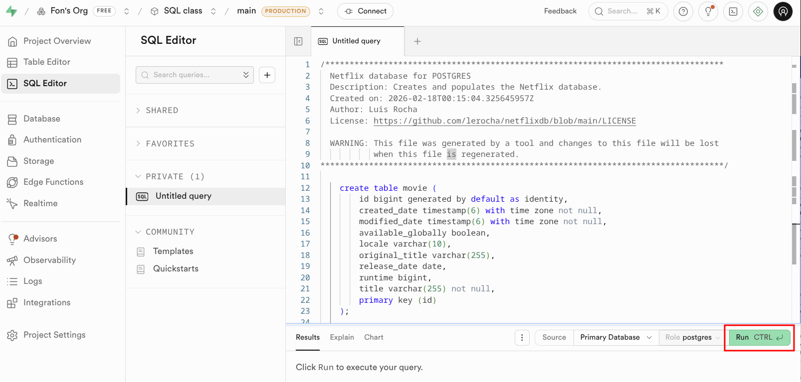

### Check the tables
See all four tables `movie`, `tv_show`, `season`, `view_summary` in the Schema Vizualizer.
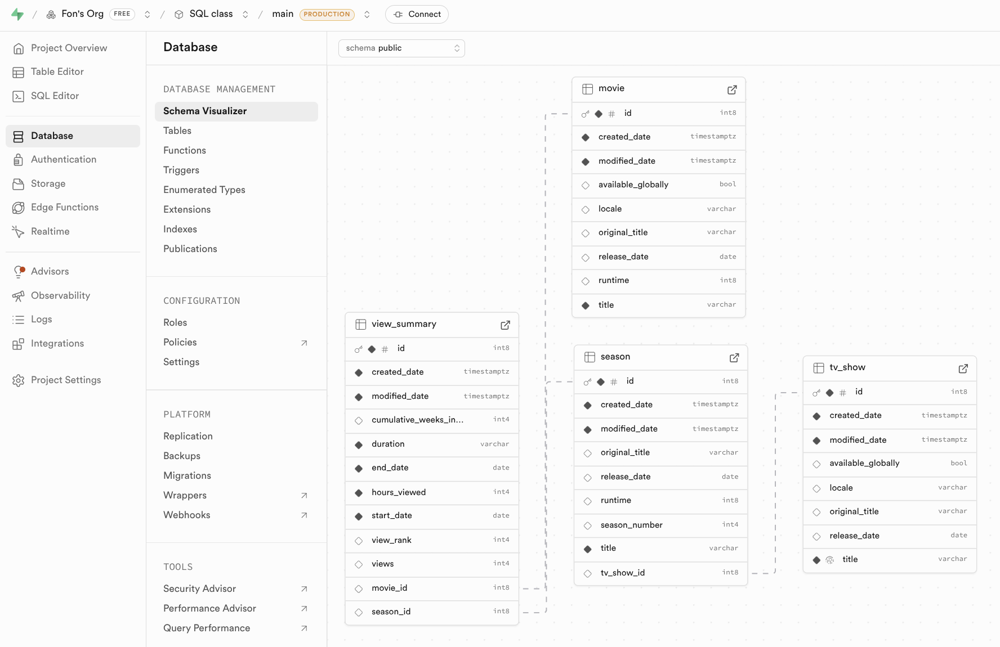

### Import data from CSV files
In Supabase, there are limitation on the size of the SQL file that can be run on SQL Editor. So we need to import the data in bulk using CSV.

Go to Table Editor, then select table, and click Insert -> **Import data from CSV**. Or just click the button in the middle of screen.
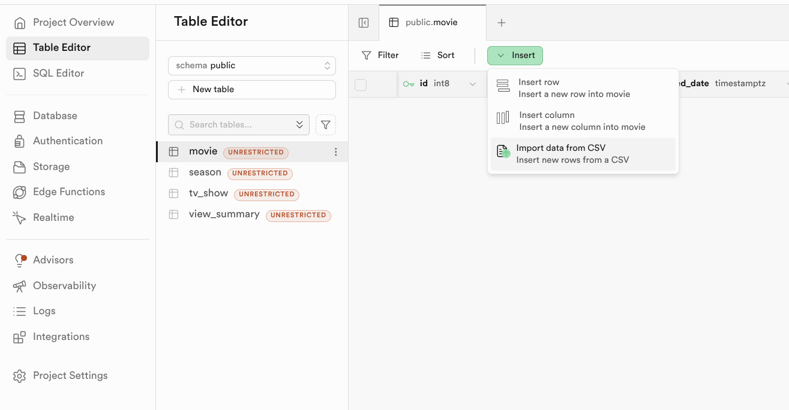

Select the CSV file from `data/` folder according to the table name. Then click Import data, or `crtl/cmd + enter`.
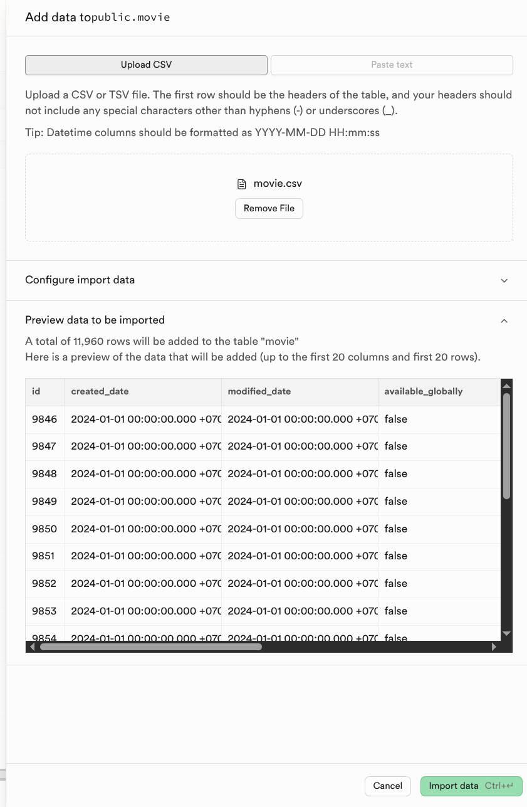
**Repeat the process for all tables in this order `movie` -> `tv_show` -> `season` -> `view_summary`**

### Verify the data from Database -> Tables
Click Database on left panel, Then `Tables` to verify the number of rows in each table.
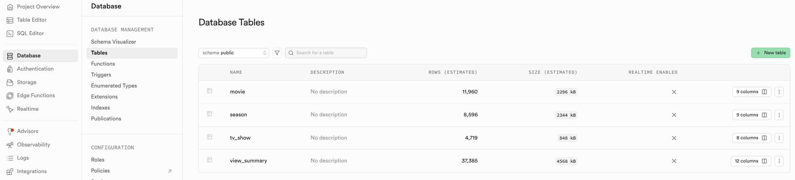

# Schema
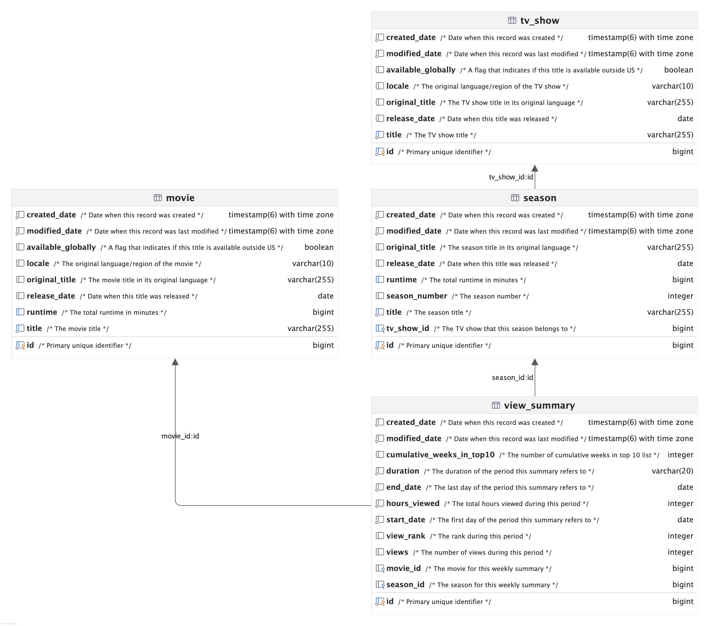
### 1. The Core Content Tables

These tables store the static metadata about the movies on Netflix.

* **`movie`**: This table stores information about standalone films. It includes standard metadata like the title, original title, locale, release date, and total runtime. It also has a boolean flag, available_globally. The primary key uniquely identifying each record is `id`.

* **`tv_show`**: This table stores top-level information about a TV series as a whole. Similar to movies, it tracks the title, locale, release date, and global availability. Its primary key is `id`.

* **`season`**: Because TV shows are episodic and broken into parts, this table handles the specific seasons of a show. It tracks the season title, season number, release date, and total runtime for that season. Its primary key is `id`.

### 2. The Analytics Table

This table tracks the performance and popularity of the content.

* **`view_summary`**: This table stores viewership metrics over a specific time period (defined by start_date, end_date, and duration). It records data points like total views, hours_viewed, the title's view_rank, and cumulative_weeks_in_top10. Its primary key is `id`.

### 3. How the Tables are Related

The arrows in the diagram represent the relationships between the tables, enforced by Foreign Keys (FK) linking to Primary Keys (PK).

* **TV Show to Season (One-to-Many):** One TV show can have multiple seasons, but a season belongs to exactly one TV show. The `season` table contains a foreign key called `tv_show_id` that points directly to the `id` of the `tv_show` table.
* **Movie to View Summary (One-to-Many):** A single movie can have multiple view summaries generated over time (for example, weekly reports). The `view_summary` table contains a `movie_id` foreign key that points to the `movie` table's `id`.
* **Season to View Summary (One-to-Many):** A specific TV show season can have multiple view summaries over time. The `view_summary` table contains a `season_id` foreign key that points to the `season` table's `id`.

In practice, a single record in the `view_summary` table will likely track the stats for *either* a movie *or* a season, meaning either `movie_id` or `season_id` would be populated while the other might be left null.
 

# Connect to Supabase using DBeaver
1. Click Connect button
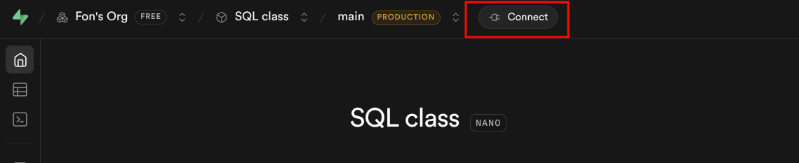
2. Copy hostname from Supabase connection string. Notice that the user name and database name is `postgres`. The default port is `5432`.
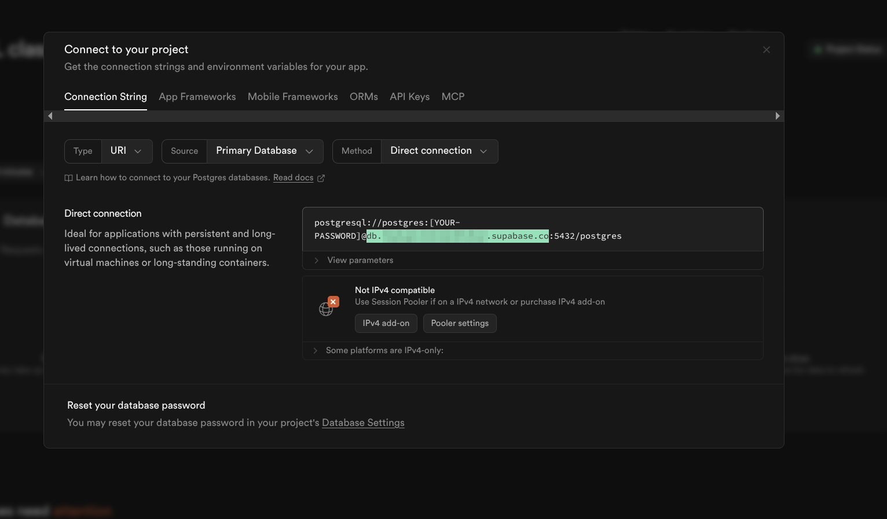
3. In Dbeaver, click New Connection
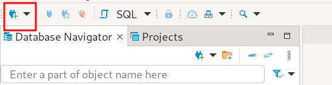
4. Select PostgreSQL, then click Next
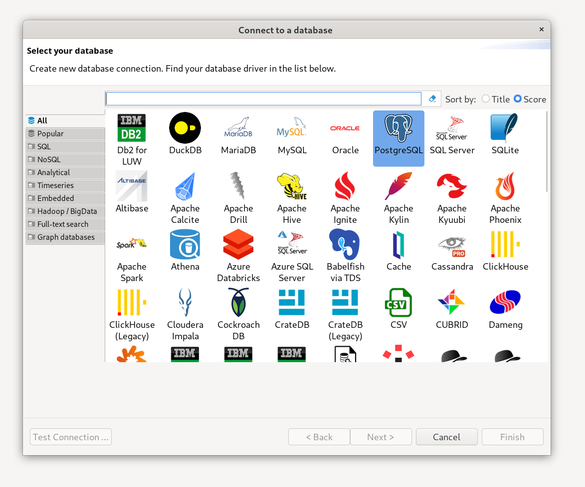
5. Fill in the connection details: Pasted the copied Hostname, and fill in your password. The other fields should be left as default. Click Finish.
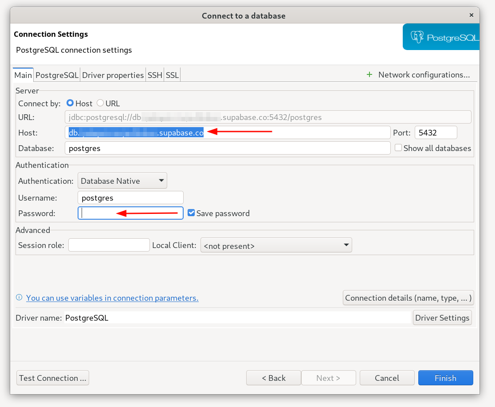
6. Double-click to PostgreSQL connection to connect to Supabase, if you don't have the PostgreSQL driver downloaded, click Download.
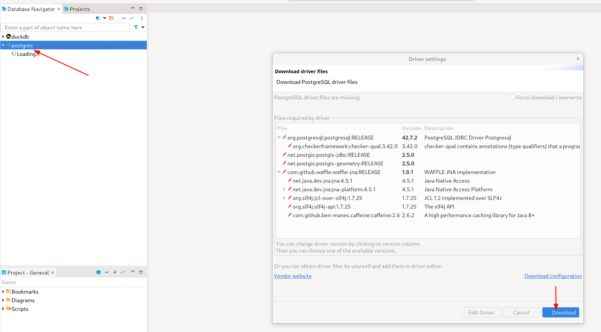
7. Green checkmark means connection is successful. Click New SQL script.
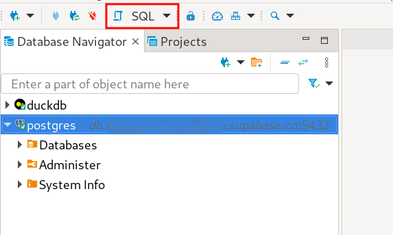
8. Now you can run the SQL script to query the data. Click Run SQL script. Or if you want to run by command use the short cut `ctrl/cmd + enter`. You may find your list of tables in the left panel.
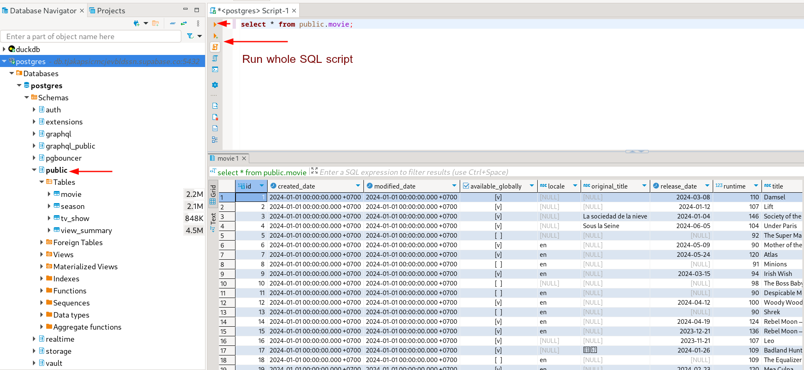

## Sample Queries - Postgres

Movies released since 2024-01-01.
```sql
-- Movies released since 2024-01-01
select id, title, runtime from movie where release_date >= '2024-01-01';
```

TV Show Seasons released since 2024-01-01
```sql
-- TV Show Seasons released since 2024-01-01
select s.id, s.title as season_title, s.season_number, t.title as tv_show, s.runtime
from season s left join tv_show t on t.id = s.tv_show_id
where s.release_date >= '2024-01-01';
```

Top 10 movies (English)
```sql
-- Top 10 movies (English)
select v.view_rank, m.title, v.hours_viewed, m.runtime, v.views, v.cumulative_weeks_in_top10
from view_summary v
inner join movie m on m.id = v.movie_id
where duration = 'WEEKLY'
  and end_date = '2025-06-29'
  and m.locale = 'en'
order by v.view_rank;
```

Engagement report
```sql
-- Engagement report
select m.title, m.original_title, m.available_globally, m.release_date, v.hours_viewed, m.runtime, v.views
from view_summary v
inner join movie m on m.id = v.movie_id
where duration = 'SEMI_ANNUALLY'
  and start_date = '2024-01-01'
order by v.view_rank asc;
```

# References

**Credit:** 
Original dataset from https://github.com/lerocha/netflixdb/releases/tag/v1.0.41

Data Sources
* https://about.netflix.com/en/news/what-we-watched-the-first-half-of-2024
* https://about.netflix.com/en/news/what-we-watched-the-second-half-of-2023
* https://www.netflix.com/tudum/top10